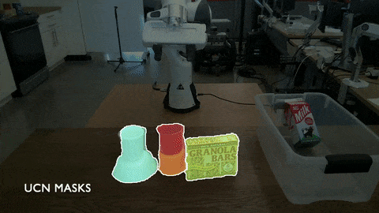

# RICE: Refining Instance Masks in Cluttered Environments with Graph Neural Networks

## Introduction

In this work, we propose a novel framework that refines initial instance segmentations of unseen objects by utilizing a graph-based representation of the instance masks. 
We train deep networks capable of sampling smart perturbations to the segmentations, and a graph neural network, which can encode relations between objects, to evaluate the perturbed segmentations. 
Our proposed method is orthogonal to previous works that directly predict instance segmentations and achieves state-of-the-art performance when combined with them. 
We demonstrate an application that uses uncertainty estimates generated by our method to guide a manipulator, leading to efficient understanding of cluttered scenes.

### Refinements

RICE is able to refine initial instance segmentation masks by sampling these perturbations: 1) splits, 2) merges, 3) deletes, and 4) adds. The following image demonstrates how each of these perturbations leads to the better segmentations.

### Guiding a Manipulator with Contour Uncertainties from RICE

We demonstrate a proof-of-concept efficient scene understanding application that utilizes uncertainties output by RICE to guide a manipulator.

### Sample Tree Example

We show an example of a sample tree with branch factor $B=2$ and $K=2$ expansion iterations. We also visualize the ground truth score and the predicted score from our graph neural network, known as SGS-Net. Note that the SGS-Net scores improve as the graph node gets further away from the root. In this particular example, SGS-Net would return the bottom left graph, which is also the most accurate graph.

## Code

Coming Soon!