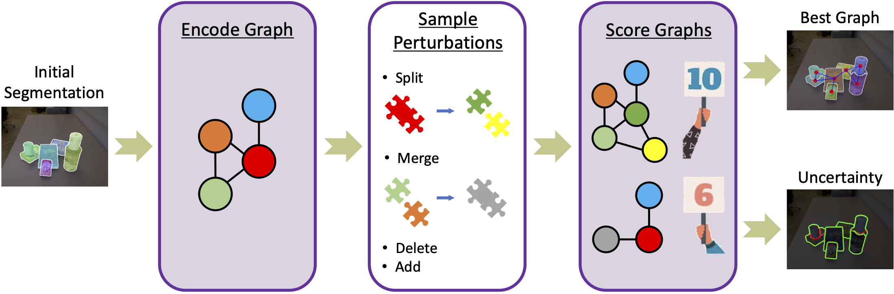

# RICE: Refining Instance Masks in Cluttered Environments with Graph Neural Networks
This is the codebase for our paper:

[RICE: Refining Instance Masks in Cluttered Environments with Graph Neural Networks](https://arxiv.org/abs/2106.15711)<br/>
[Christopher Xie](https://chrisdxie.github.io/), [Arsalan Mousavian](https://cs.gmu.edu/~amousavi/), [Yu Xiang](https://yuxng.github.io/), [Dieter Fox](https://homes.cs.washington.edu/~fox/)<br/>
Conference on Robot Learning - CoRL, 2021

## Introduction

<p align="center"></p>

In this work, we propose a novel framework that refines initial instance segmentations of unseen objects by utilizing a graph-based representation of the instance masks. 
We train deep networks capable of sampling smart perturbations to the segmentations, and a graph neural network, which can encode relations between objects, to evaluate the perturbed segmentations. 
Our proposed method is orthogonal to previous works that directly predict instance segmentations and achieves state-of-the-art performance when combined with them. 
We demonstrate an application that uses uncertainty estimates generated by our method to guide a manipulator, leading to efficient understanding of cluttered scenes.

### Refinements

RICE is able to refine initial instance segmentation masks by sampling these perturbations: 1) splits, 2) merges, 3) deletes, and 4) adds. The following image demonstrates how each of these perturbations leads to the better segmentations.

<p align="center"></p>

### Guiding a Manipulator with Contour Uncertainties from RICE

We demonstrate a proof-of-concept efficient scene understanding application that utilizes uncertainties output by RICE to guide a manipulator. You can find the full video [here](https://www.youtube.com/watch?v=fIM80ZqH77A).

<p align="center"></p>

### Sample Tree Example

We show an example of a sample tree with branch factor B=2 and K=2 expansion iterations. We also visualize the ground truth score and the predicted score from our graph neural network, known as SGS-Net. Note that the SGS-Net scores improve as the graph node gets further away from the root. In this particular example, SGS-Net would return the bottom left graph, which is also the most accurate graph.

<p align="center"></p>

## Code

### Installation

We highly recommend setting up a virtual environment using [Anaconda](https://www.anaconda.com/). Here is an example setup using these tools:

```
git clone --recurse-submodules https://github.com/chrisdxie/rice.git
cd rice
conda env create -f env.yml
```
Note: Currently, [env.yml](env.yml) is setup to use CUDA version 10.2 and PyTorch 1.8.0. With these settings, PyTorch Geometric can be installed via `conda` as well. If you need to use an older version of CUDA and/or PyTorch, you'll have to install Pytorch Geometric [manually](https://pytorch-geometric.readthedocs.io/en/latest/notes/installation.html#installation-via-pip-wheels) via Pip wheels, but it should be pretty easy.

### Models

You can find the models [here](https://drive.google.com/uc?export=download&id=1d-55B2Bg_e2aM5vzka-y2Dx0XbkpOCRl). We provide models for SplitNet, DeleteNet and SGS-Net trained on our synthetic Tabletop Object Dataset (which slightly more cluttered than [before](https://github.com/chrisdxie/uois)). 

### Data

You can find the slightly more cluttered version of the Tabletop Object Dataset (TOD) [here](https://drive.google.com/uc?export=download&id=1M_dXeZHf-zEPyhPpLz4XA80qXHt3ZrDK). See the [data loading](src/data_loader.py) and [data augmentation](src/data_augmentation.py) code for more details.


### Train the network

We provide sample training code for SplitNet, DeleteNet, and SGS-Net in [train.ipynb](train.ipynb).

### Running RICE!

See [RICE_example.ipynb](RICE_example.ipynb) for an example of how to run RICE on provided example images. In order to run this file, Jupyter Notebook must be installed (this is included in `env.yml`). If you haven't used Jupyter Notebooks before, [here](https://www.dataquest.io/blog/jupyter-notebook-tutorial/) is a tutorial to get you up to speed. This repository provides a few images in the [example_images](example_images/) folder. 

Notes:

* Make sure to activate the Anaconda environment before running jupyter. This can be done with ``` conda activate rice; jupyter notebook ```
* the notebook should be run in the directory in which it lives (`<ROOT_DIR>`), otherwise the filepaths and imports must be manually adjusted.
* After downloading and unzipping the models, make sure to update the notebook to point to where the models live. Look for the `TODO`'s.
* In order to run the notebook, you will also need to download the UOIS-Net-3D [models](https://github.com/chrisdxie/uois) and also edit those filepaths in the notebook.

## Citation
Our code is released under the MIT license.

If you find our work helpful in your research, please cite our work.

```
@inproceedings{xie2021rice,
author      = {Christopher Xie and Arsalan Mousavian and Yu Xiang and Dieter Fox},
title       = {RICE: Refining Instance Masks in Cluttered Environments with Graph Neural Networks},
booktitle   = {Conference on Robot Learning (CoRL)},
year        = {2021}
}
```
